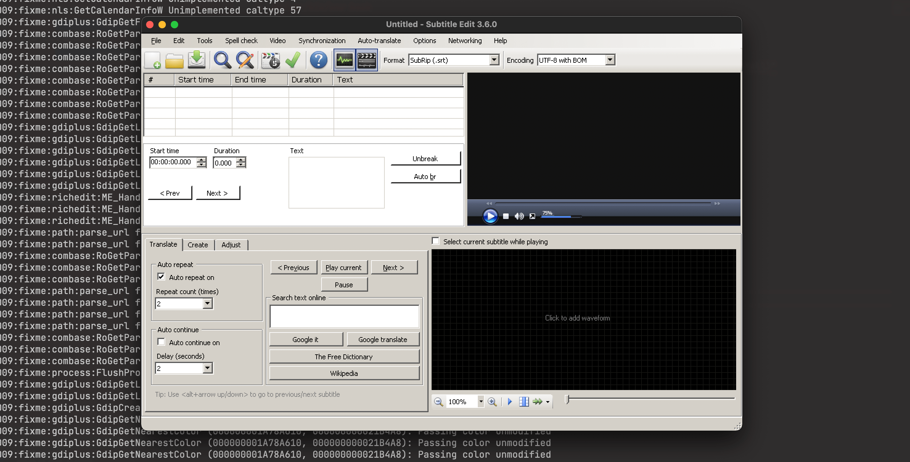

# subtitle-edit-mac-wine

Way to use [Subtitle Edit](https://github.com/SubtitleEdit/subtitleedit/) on macOS 11



## Installation

1. Download and unzip [this repository](./archive/refs/heads/main.zip)
2. Double-click `install-mac.command`
3. When asked, go to the [Subtitle Edit releases page](https://github.com/SubtitleEdit/subtitleedit/releases)
4. In the _Latest releases_ section, right click the ZIP for the Portable version, for example [`SE360.zip`](https://github.com/SubtitleEdit/subtitleedit/releases/download/3.6.0/SE360.zip) and copy the link
5. Paste the link to Terminal and press Enter.
6. Wait until the installation of Homebrew, Wine, winetricks and .NET is completed.

## Usage

Now open Terminal.app and type:

```
subtitleeditw
```

to run the GUI version of Subtitle Edit, or

```
subtitleeditw /help```

to run the CLI version of Subtitle Edit.

## Credits

- Shell scripts written by Adam Twardoch
- Only tested on my machine, no guarantee
- [The Unlicense](./LICENSE)
- Subtitle Edit is made by Nikolaj Lynge Olsson
